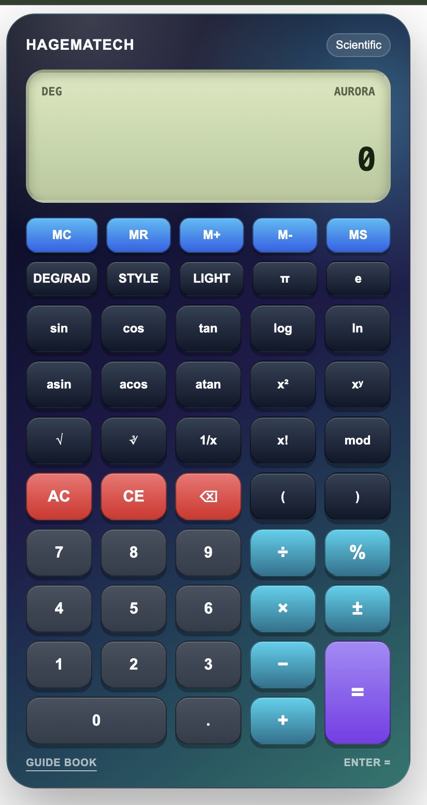
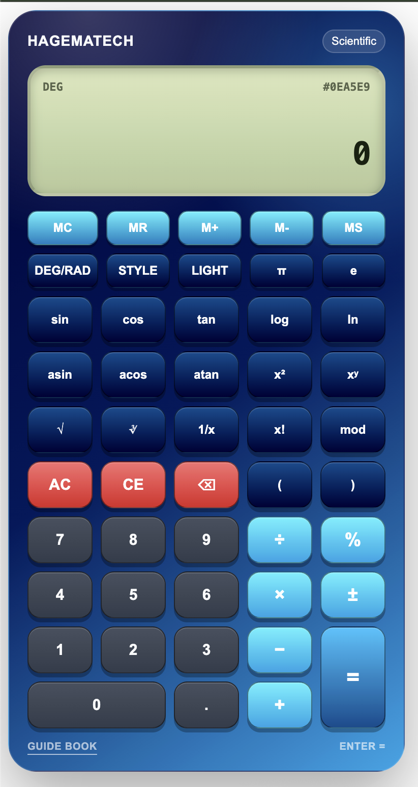

# Hagematech Calculator

A beautiful, responsive, scientific calculator Web Component with physical calculator style, custom gradients, custom hex colors, memory functions, keyboard support, and a built-in bilingual Guide Book.

Use it with one simple HTML tag:

```html
<hagematech-calc></hagematech-calc>
```

---

## Preview

### Default Aurora

<p align="center">
  
</p>

Copy and paste:

```html
<hagematech-calc></hagematech-calc>
```

---

### Ocean Gradient

<p align="center">
  
</p>

Copy and paste:

```html
<hagematech-calc gradient="ocean"></hagematech-calc>
```

---

### Forest Gradient

<p align="center">
  
</p>

Copy and paste:

```html
<hagematech-calc gradient="forest"></hagematech-calc>
```

---

### Custom Hex Color

<p align="center">
  
</p>

Copy and paste:

```html
<hagematech-calc color="#0ea5e9"></hagematech-calc>
```

---

### Built-in Guide Book


The calculator includes a built-in bilingual Guide Book in English and Indonesian.

---

## Features

- Scientific calculator Web Component
- Simple custom HTML tag
- Works with npm, CDN, plain HTML, React, Vue, Laravel, Next.js, Vite, Astro, and more
- Shadow DOM style isolation
- Physical calculator-style design
- Responsive mobile-friendly layout
- Professional loading state
- Professional error state
- Built-in bilingual Guide Book
- English and Indonesian usage guide
- Custom gradient themes
- Custom hexadecimal color support
- Light and dark mode
- DEG/RAD angle mode
- Memory functions
- Keyboard support
- Basic arithmetic operations
- Scientific operations
- Powered by math.js

---

## Installation

There are two main ways to use Hagematech Calculator:

1. Install with npm
2. Use directly from CDN

---

# 1. Install with npm

```bash
npm install hagematech-calc
```

Using yarn:

```bash
yarn add hagematech-calc
```

Using pnpm:

```bash
pnpm add hagematech-calc
```

---

## Basic npm Usage

Import the package once in your JavaScript entry file:

```js
import 'hagematech-calc';
```

Then use the tag anywhere in your HTML/template:

```html
<hagematech-calc></hagematech-calc>
```

---

## Vite Usage

### `main.js`

```js
import 'hagematech-calc';
```

### `index.html`

```html
<hagematech-calc></hagematech-calc>
```

Example with gradient:

```html
<hagematech-calc gradient="ocean"></hagematech-calc>
```

---

## React Usage

Install:

```bash
npm install hagematech-calc
```

Import it once:

```jsx
import 'hagematech-calc';

export default function App() {
    return (
        <div>
            <h1>Hagematech Calculator Demo</h1>

            <hagematech-calc></hagematech-calc>
        </div>
    );
}
```

Example with custom attributes:

```jsx
import 'hagematech-calc';

export default function App() {
    return (
        <hagematech-calc
            gradient="sunset"
            theme="dark"
            angle-mode="DEG"
            precision="16"
        ></hagematech-calc>
    );
}
```

---

## React TypeScript Support

If TypeScript shows an error for the custom element, create:

```txt
src/custom-elements.d.ts
```

Then add:

```ts
import React from 'react';

declare global {
    namespace JSX {
        interface IntrinsicElements {
            'hagematech-calc': React.DetailedHTMLProps<
                React.HTMLAttributes<HTMLElement>,
                HTMLElement
            > & {
                gradient?: string;
                color?: string;
                theme?: string;
                'angle-mode'?: string;
                precision?: string;
                'max-length'?: string;
            };
        }
    }
}

export {};
```

---

## Vue Usage

### `main.js`

```js
import 'hagematech-calc';
```

### Component

```vue
<template>
    <hagematech-calc gradient="forest"></hagematech-calc>
</template>
```

If Vue shows a warning about custom elements, configure it as a custom element.

### Vite + Vue Config

```js
export default {
    compilerOptions: {
        isCustomElement: (tag) => tag === 'hagematech-calc'
    }
}
```

---

## Laravel + Vite Usage

Install:

```bash
npm install hagematech-calc
```

Import in:

```txt
resources/js/app.js
```

```js
import 'hagematech-calc';
```

Use in Blade:

```blade
<hagematech-calc></hagematech-calc>
```

With custom style:

```blade
<hagematech-calc gradient="ocean" theme="dark"></hagematech-calc>
```

---

## Next.js Usage

Because this package registers a browser custom element, import it on the client side.

```jsx
'use client';

import { useEffect } from 'react';

export default function Calculator() {
    useEffect(() => {
        import('hagematech-calc');
    }, []);

    return (
        <hagematech-calc gradient="aurora"></hagematech-calc>
    );
}
```

---

## Astro Usage

Import the package in your page or layout:

```astro
---
import 'hagematech-calc';
---

<hagematech-calc gradient="grape"></hagematech-calc>
```

---

# 2. CDN Usage

You can use the package directly from CDN without installing anything.

## jsDelivr CDN

```html
<script src="https://cdn.jsdelivr.net/npm/hagematech-calc@1.0.0"></script>

<hagematech-calc></hagematech-calc>
```

## unpkg CDN

```html
<script src="https://unpkg.com/hagematech-calc@1.0.0"></script>

<hagematech-calc></hagematech-calc>
```

If your package entry file is inside `dist`, use:

```html
<script src="https://cdn.jsdelivr.net/npm/hagematech-calc@1.0.0/dist/hagematech-calc.js"></script>

<hagematech-calc></hagematech-calc>
```

---

## Full CDN Example

```html
<!DOCTYPE html>
<html lang="en">
<head>
    <meta charset="UTF-8">
    <title>Hagematech Calculator Demo</title>

    <script src="https://cdn.jsdelivr.net/npm/hagematech-calc@1.0.0"></script>
</head>
<body>

    <h1>Hagematech Calculator Demo</h1>

    <hagematech-calc></hagematech-calc>

</body>
</html>
```

---

## Recommended Production Usage

For production, always use a fixed version:

```html
<script src="https://cdn.jsdelivr.net/npm/hagematech-calc@1.0.0"></script>
```

Avoid using the latest version directly in production if you need stable behavior.

---

## Basic Usage

```html
<hagematech-calc></hagematech-calc>
```

---

## Built-in Gradient Themes

Available gradients:

- `aurora`
- `sunset`
- `ocean`
- `forest`
- `grape`
- `gold`

---

### Aurora


```html
<hagematech-calc gradient="aurora"></hagematech-calc>
```

---

### Sunset


```html
<hagematech-calc gradient="sunset"></hagematech-calc>
```

---

### Ocean


```html
<hagematech-calc gradient="ocean"></hagematech-calc>
```

---

### Forest


```html
<hagematech-calc gradient="forest"></hagematech-calc>
```

---

### Grape


```html
<hagematech-calc gradient="grape"></hagematech-calc>
```

---

### Gold


```html
<hagematech-calc gradient="gold"></hagematech-calc>
```

---

## Custom Hex Color

You can use your own hexadecimal color.

```html
<hagematech-calc color="#0ea5e9"></hagematech-calc>
```

```html
<hagematech-calc color="#dc2626"></hagematech-calc>
```

```html
<hagematech-calc color="#16a34a"></hagematech-calc>
```

When the `color` attribute is provided, the calculator automatically generates matching gradients from that color.

---

## Light and Dark Mode

Default theme is `dark`.

### Dark Mode

```html
<hagematech-calc theme="dark"></hagematech-calc>
```

### Light Mode

```html
<hagematech-calc theme="light"></hagematech-calc>
```

The calculator also includes a `LIGHT` button to switch between light and dark mode.

---

## Angle Mode

Default angle mode is `DEG`.

### Degree Mode

```html
<hagematech-calc angle-mode="DEG"></hagematech-calc>
```

### Radian Mode

```html
<hagematech-calc angle-mode="RAD"></hagematech-calc>
```

The calculator also includes a `DEG/RAD` button.

---

## Precision

Default precision is `16`.

```html
<hagematech-calc precision="16"></hagematech-calc>
```

Higher precision:

```html
<hagematech-calc precision="32"></hagematech-calc>
```

---

## Max Expression Length

Default max expression length is `300`.

```html
<hagematech-calc max-length="300"></hagematech-calc>
```

---

## Multiple Calculators on One Page

Each calculator instance works independently.

```html
<hagematech-calc gradient="aurora"></hagematech-calc>

<hagematech-calc gradient="sunset"></hagematech-calc>

<hagematech-calc gradient="ocean"></hagematech-calc>

<hagematech-calc color="#0ea5e9"></hagematech-calc>

<hagematech-calc color="#dc2626"></hagematech-calc>
```

---

## Attributes

| Attribute | Type | Default | Description |
|---|---|---|---|
| `gradient` | string | `aurora` | Selects a built-in gradient theme |
| `color` | hex color | empty | Generates a custom calculator style from a hex color |
| `theme` | string | `dark` | Sets theme mode: `dark` or `light` |
| `angle-mode` | string | `DEG` | Sets trigonometry mode: `DEG` or `RAD` |
| `precision` | number | `16` | Controls displayed result precision |
| `max-length` | number | `300` | Maximum allowed expression length |

---

## Supported Operations

### Basic Operations

| Operation | Button |
|---|---|
| Addition | `+` |
| Subtraction | `−` |
| Multiplication | `×` |
| Division | `÷` |
| Percent | `%` |
| Equals | `=` |
| Clear all | `AC` |
| Clear entry | `CE` |
| Backspace | `⌫` |
| Toggle sign | `±` |

---

## Scientific Operations

| Function | Button |
|---|---|
| Sine | `sin` |
| Cosine | `cos` |
| Tangent | `tan` |
| Arc sine | `asin` |
| Arc cosine | `acos` |
| Arc tangent | `atan` |
| Log base 10 | `log` |
| Natural logarithm | `ln` |
| Square root | `√` |
| Cube root | `∛` |
| Square | `x²` |
| Power | `xʸ` |
| Inverse | `1/x` |
| Factorial | `x!` |
| Modulo | `mod` |

---

## Constants

| Constant | Button |
|---|---|
| Pi | `π` |
| Euler's number | `e` |

---

## Memory Functions

| Button | Description |
|---|---|
| `MS` | Save current value to memory |
| `MR` | Recall saved memory value |
| `M+` | Add current value to memory |
| `M-` | Subtract current value from memory |
| `MC` | Clear memory |

---

## Keyboard Support

| Key | Action |
|---|---|
| `0-9` | Input numbers |
| `+` | Addition |
| `-` | Subtraction |
| `*` | Multiplication |
| `/` | Division |
| `.` | Decimal point |
| `%` | Percent |
| `Enter` | Calculate |
| `Backspace` | Delete one character |
| `Escape` | Clear all or close Guide Book |

---

## Guide Book

The calculator includes a built-in bilingual Guide Book.

Click the underlined `Guide Book` link at the bottom of the calculator to open the usage guide.

The Guide Book includes:

- English guide
- Indonesian guide
- Basic calculation instructions
- Scientific function instructions
- Memory function instructions
- Theme and style instructions

---

## Calculation Event

The component dispatches a `calculate` event after a successful calculation.

```html
<hagematech-calc id="calc"></hagematech-calc>

<script>
    document.getElementById('calc').addEventListener('calculate', function (event) {
        console.log(event.detail.expression);
        console.log(event.detail.result);
    });
</script>
```

Event detail:

```js
{
    expression: "2+2",
    result: "4"
}
```

---

## Styling

Hagematech Calculator uses Shadow DOM, so its internal style is isolated from your website CSS.

You can customize the calculator through attributes:

```html
<hagematech-calc gradient="ocean"></hagematech-calc>
```

```html
<hagematech-calc color="#7c3aed"></hagematech-calc>
```

---

## Dependency

Hagematech Calculator automatically loads the calculation engine from math.js CDN.

No manual math.js setup is required.

---

## Browser Support

Hagematech Calculator works in modern browsers that support Web Components and Shadow DOM.

Recommended browsers:

- Google Chrome
- Microsoft Edge
- Mozilla Firefox
- Safari

---

## Package Setup Recommendation

Recommended `package.json`:

```json
{
  "name": "hagematech-calc",
  "version": "1.0.0",
  "description": "A modern scientific calculator Web Component with gradients, memory functions, keyboard support, and bilingual guide book.",
  "main": "hagematech-calc.js",
  "unpkg": "hagematech-calc.js",
  "jsdelivr": "hagematech-calc.js",
  "files": [
    "hagematech-calc.js",
    "README.md",
    "LICENSE",
    "NOTICE",
    "docs"
  ],
  "keywords": [
    "calculator",
    "scientific-calculator",
    "web-component",
    "custom-element",
    "math",
    "mathjs",
    "hagematech",
    "shadow-dom",
    "javascript"
  ],
  "author": "Hagematech",
  "license": "AGPL-3.0-or-later"
}
```

If your source file is inside `dist`, use:

```json
{
  "name": "hagematech-calc",
  "version": "1.0.0",
  "description": "A modern scientific calculator Web Component with gradients, memory functions, keyboard support, and bilingual guide book.",
  "main": "dist/hagematech-calc.js",
  "unpkg": "dist/hagematech-calc.js",
  "jsdelivr": "dist/hagematech-calc.js",
  "files": [
    "dist",
    "README.md",
    "LICENSE",
    "NOTICE",
    "docs"
  ],
  "keywords": [
    "calculator",
    "scientific-calculator",
    "web-component",
    "custom-element",
    "math",
    "mathjs",
    "hagematech",
    "shadow-dom",
    "javascript"
  ],
  "author": "Hagematech",
  "license": "AGPL-3.0-or-later"
}
```

---

## Publishing to npm

Login:

```bash
npm login
```

Publish:

```bash
npm publish
```

For a patch update:

```bash
npm version patch
npm publish
```

For a minor update:

```bash
npm version minor
npm publish
```

For a major update:

```bash
npm version major
npm publish
```

---

## License

This project is available as an open source project with visible Hagematech attribution.

You may use, study, modify, and distribute this project under the selected open source license.

Visible Hagematech branding must remain intact in the free version.

To remove Hagematech branding from the calculator interface, a commercial branding removal license is required.

---

## Commercial Branding Removal

The open source version is free to use with visible Hagematech attribution.

If you want to remove the Hagematech branding, logo, author notice, or visible attribution from the calculator interface, you must purchase a commercial branding removal license.

Commercial license benefits:

- Remove visible Hagematech branding
- Use without public attribution
- Use in client projects
- Use in commercial dashboards, ERP, POS, admin panels, SaaS, or internal business tools
- Optional priority support

For commercial licensing, contact:

- Email: your-email@example.com
- Website: https://yourdomain.com

---

## Author

Created by Hagematech.

---

## Version

Current version:

```txt
1.0.0
```

---

## Quick Copy Paste

### npm

```bash
npm install hagematech-calc
```

```js
import 'hagematech-calc';
```

```html
<hagematech-calc></hagematech-calc>
```

### CDN

```html
<script src="https://cdn.jsdelivr.net/npm/hagematech-calc@1.0.0"></script>

<hagematech-calc></hagematech-calc>
```

### Gradient

```html
<hagematech-calc gradient="ocean"></hagematech-calc>
```

### Custom Color

```html
<hagematech-calc color="#0ea5e9"></hagematech-calc>
```